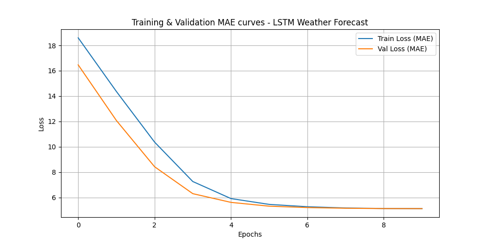

# Weather Time-Series Forecasting


A PyTorch project that builds **stacked-LSTM** sequence predictors for meteorological metrics
(temperature, humidity, pressure) and studies how recurrent models compare to classical
**ARIMA/SARIMA** baselines on trend- and seasonality-heavy signals.

> **Data note:** training uses a **synthetic** meteorological series with injected trend +
> seasonality + noise, so the pipeline is fully reproducible without an external dataset. Swap in
> real sensor data via `data_loader.py` to benchmark on live feeds.

## Architecture
- **Model:** stacked 2-layer LSTM, 64 hidden units, 0.2 dropout.
- **Sequence mapping:** 24-step rolling context → next-step forecast.
- **Training:** MAE loss, Adam optimizer; exports `loss_curve.png`.



## Run
```bash
pip install -r requirements.txt
python train.py     # generates synthetic data, trains 20 epochs, saves loss_curve.png
```

## Files
```
lstm_model.py    # PyTorch LSTM definitions
data_loader.py   # rolling-window formatting
train.py         # synthetic data + training loop
```

## Why
To get hands-on with time-series decomposition (trend / seasonality / residual) and understand
where autoregressive statistical models struggle with non-linear, multivariate dependencies that a
recurrent network can capture.
